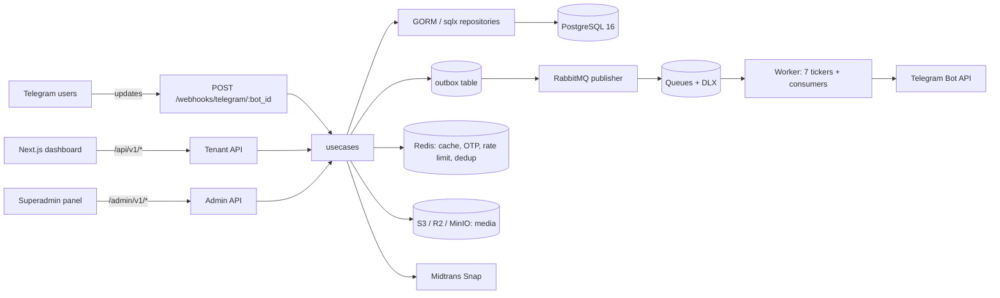

# tg-manager — Telegram Community Management API

Backend for a multi-tenant SaaS that runs **paid Telegram communities**: connect bots, gate group
memberships behind subscription packages, collect payments (Midtrans), enforce expiry, broadcast to
groups, and bill tenants — with a separate platform-operator API for superadmins.

`Go 1.26` · `Fiber v3` · `PostgreSQL 16` · `Redis 7` · `RabbitMQ 3.13` · `S3-compatible storage`

> Frontend: [tg-manager-fe](https://github.com/Fadlihardiyanto/tg-manager-fe) (Next.js 16 + shadcn/ui).
> OpenAPI 3.0.3 spec: [`api/api.yml`](api/api.yml).

---

## Architecture



Two processes, one codebase:

| Process | Entry point | Role |
| --- | --- | --- |
| Web API | `cmd/web/main.go` | Fiber HTTP server on `APP_PORT` (default `8080`), graceful shutdown on SIGINT/SIGTERM |
| Worker | `cmd/worker/main.go` | Consumes RabbitMQ queues and runs 7 periodic workers (outbox, order cleanup, enforcer, group sync, expiry reminder, broadcast scheduler, daily report) |

---

## Features

**Public API** — platform plans, member checkout (Midtrans Snap), checkout detail/cancel,
Telegram bot webhook, Midtrans webhooks (billing + member), Prometheus `/metrics`.

**Tenant API** (`/api/v1`, JWT):
- Auth & onboarding — register, login, email verification, refresh, logout, client onboarding
- Bots — CRUD, connect token/status, bulk delete
- Groups — CRUD, disconnect, sync, bulk delete
- Packages & discounts — package CRUD with group links, activate/deactivate, percentage/fixed discounts
- Members — listing, detail, kick, extend, sync, resend invite link
- Custom commands — CRUD + bulk delete (validated against the owning bot)
- Broadcasts — rich-text/media broadcasts per bot with scheduling
- Transactions, analytics, audit logs, report settings/failures
- Settings — profile, payment credentials (AES-256 at rest + ECDH key exchange), uploads (presigned URLs)
- Migration — bulk member import

**Admin API** (`/admin/v1`, separate JWT realm):
- Auth with OTP + 2FA (`setup`/`enable`), refresh, logout, health
- Roles & permissions, admin users, clients (+ impersonation), billing plans, platform discounts, audit logs

**Telegram bot commands** — `start`/`help`, `packages`, package selection callback, `mysub`/`status`,
`myorders`, member migration, plus custom commands registered per bot.

---

## Tech stack

| Concern | Choice |
| --- | --- |
| HTTP | `gofiber/fiber/v3` 3.2.0, `bytedance/sonic` JSON, `go-playground/validator/v10` |
| Data access | `gorm.io/gorm` 1.31 + `driver/postgres`, raw SQL via `jmoiron/sqlx` |
| Cache / rate limit | `redis/go-redis/v9` (Lua token-bucket limiter in `pkg/ratelimit`) |
| Messaging | `rabbitmq/amqp091-go` (work queues with dead-lettering) + transactional outbox |
| Storage | `aws-sdk-go-v2` S3 client (Cloudflare R2 / MinIO / AWS) |
| Auth | `golang-jwt/jwt/v5` (HS256, two isolated realms), bcrypt, AES-256 + ECDH |
| Payments | Midtrans Snap (`pkg/midtrans`) |
| Telegram | `go-telegram-bot-api/telegram-bot-api/v5` |
| Documents | `johnfercher/maroto/v2` PDF receipts |
| Ops | `zap` logging, Prometheus metrics, Viper + godotenv config, SMTP mailer, Redis-backed email OTP |

---

## Quick start

### Requirements

- Go **1.26+** (module targets `go 1.26.6`)
- PostgreSQL 16, Redis 7, RabbitMQ 3.13 — Docker Compose can provide them
- Docker (optional) for the infrastructure stack

### 1. Configuration

```bash
cp .env.example .env
```

Boot fails fast if `APP_ENCRYPTION_KEY`, `ADMIN_JWT_SECRET`, or `JWT_SECRET` are unset, and refuses to
start in `APP_ENV=production` when `TELEGRAM_WEBHOOK_SECRET` is missing or still a placeholder
(`internal/config/viper.go`, `internal/config/bootstrap.go`).
`ENCRYPTION_KEY` must be **exactly 32 bytes** (raw or 32-byte hex).

### 2. Infrastructure

```bash
docker compose up -d postgres redis rabbitmq minio minio-init   # or: make up-infra
```

| Service | Host port | Notes |
| --- | --- | --- |
| app / worker | 8080 | dev containers driven by Air (see [Known limitations](#known-limitations)) |
| PostgreSQL | 5433 → 5432 | `postgres:16-alpine`, volume `postgres_data` |
| Redis | 6380 → 6379 | appendonly, `allkeys-lru`, 128 MB |
| RabbitMQ | 5672, 15672 (mgmt) | config from `configs/rabbitmq/` |
| MinIO | 9000, 9001 (console) | `minio-init` creates the bucket |
| pgAdmin | 8081 | |
| Gotenberg | 3000 | present in compose, unused by the Go code |

### 3. Database schema

Migrations are plain SQL in `db/migrations/` (no version prefixes), applied in order:

```bash
export PGPASSWORD=...
PSQL="psql -h localhost -p 5433 -U tgmanager -d tgmanager_db -v ON_ERROR_STOP=1"

$PSQL -f db/migrations/table.sql                        # base schema (tenant + platform + discount + broadcast layers)
$PSQL -f db/migrations/ensure_permissions_name_unique.sql
$PSQL -f db/migrations/seed_admin_rbac.sql              # admin roles/permissions
$PSQL -f db/migrations/seed_tenant_rbac.sql             # tenant roles/permissions
$PSQL -f db/migrations/add_report_settings.sql
$PSQL -f db/migrations/add_outbox_indexes.sql
$PSQL -f db/migrations/add_bot_uuid_to_orders.sql
$PSQL -f db/migrations/add_max_purchases_per_member_to_packages.sql
$PSQL -f db/migrations/add_broadcasts_table.sql
$PSQL -f db/migrations/add_scheduled_at_to_broadcasts.sql
$PSQL -f db/migrations/add_telegram_file_id_to_broadcasts.sql
$PSQL -f db/migrations/add_max_broadcasts_column.sql
```

Seeds are idempotent (`ON CONFLICT DO NOTHING`); the RBAC seeds also document how to grant the first
superadmin.

### 4. Run

```bash
go run cmd/web/main.go       # or: make run-web
go run cmd/worker/main.go    # or: make run-worker
```

Smoke checks: `GET /health` (also used by the Docker `HEALTHCHECK`), `GET /admin/v1/health`, `GET /metrics`.

Helper tools: `go run cmd/tools/sync_webhooks/main.go` (re-register Telegram webhooks),
`go run cmd/tools/test_receipt/main.go` (render a sample PDF receipt).

### Make targets

`make help` (default) · `up` · `up-infra` · `down` · `down-v` · `build` · `restart` ·
`logs` / `logs-app` / `logs-worker` · `ps` · `run-web` · `run-worker`

---

## Configuration reference

All variables and defaults are documented inline in [`.env.example`](.env.example). The groups that
matter most:

| Group | Variables |
| --- | --- |
| App | `APP_NAME`, `APP_ENV`, `APP_DEBUG`, `APP_PORT`, `APP_TIMEZONE`, `APP_BASE_URL`, `APP_FRONTEND_URL`, `APP_ENCRYPTION_KEY` |
| Database | `DB_HOST`, `DB_PORT`, `DB_USER`, `DB_PASSWORD`, `DB_NAME`, `DB_SSLMODE`, `DB_MAX_OPEN_CONNS`, `DB_MAX_IDLE_CONNS`, `DB_CONN_MAX_LIFETIME`, `DB_LOG_QUERIES` |
| Redis | `REDIS_HOST`, `REDIS_PORT`, `REDIS_PASSWORD`, `REDIS_DB`, `REDIS_POOL_SIZE` |
| RabbitMQ | `RABBITMQ_*`, `QUEUE_TELEGRAM_ACTION`, `QUEUE_TELEGRAM_ACTION_DLQ`, `QUEUE_NOTIFICATION`, `QUEUE_PAYMENT_WEBHOOK` |
| Auth | `JWT_SECRET`, `JWT_EXPIRATION`, `JWT_REFRESH_EXPIRATION`, `ADMIN_JWT_SECRET`, `ADMIN_JWT_ACCESS_EXPIRY`, `ADMIN_JWT_REFRESH_EXPIRY`, `ENCRYPTION_KEY` |
| Telegram | `TELEGRAM_WEBHOOK_SECRET`, `TELEGRAM_WEBHOOK_BASE_URL`, `TELEGRAM_API_TIMEOUT`, `TELEGRAM_RATE_LIMIT_PER_SECOND` |
| Payments | `MIDTRANS_*`, `PAYMENT_CALLBACK_URL`, `SUBSCRIPTION_GRACE_PERIOD_HOURS` |
| Storage | `S3_ENDPOINT`, `S3_ACCESS_KEY_ID`, `S3_SECRET_ACCESS_KEY`, `S3_BUCKET_NAME`, `S3_REGION`, `S3_USE_PATH_STYLE`, `S3_PUBLIC_URL` |
| CORS / rate limit | `CORS_*`, `RATE_LIMIT_*`, `WEBHOOK_RATE_LIMIT_*` |
| Observability | `LOG_LEVEL`, `LOG_FORMAT`, `LOG_OUTPUT`, `LOG_FILE_PATH`, `METRICS_ENABLED`, `METRICS_PATH` |
| Worker | `WORKER_CONCURRENCY`, `WORKER_PREFETCH_COUNT` |

---

## Design notes

**Auth & multi-tenancy.** Two isolated JWT realms share HS256 signing but use separate secrets
(`pkg/jwt`). Admin tokens carry `roles[]` + `permissions[]` (15 min access / 24 h refresh);
tenant tokens carry a single `role` + `permissions[]` (24 h access / 168 h refresh). Permission
checks therefore need no DB round-trip. The tenant is resolved from the token's `client_id` claim —
never from a path or header — and repositories scope queries by it. Users without a client yet go
through `/api/v1/clients/onboarding`. Public Telegram and Midtrans webhooks are unauthenticated but
validated by the Telegram secret header and Midtrans SHA-512 signature.

**Response envelope.** Every JSON response uses `{ success, code, message, data, errors, request_id, meta }`
(`pkg/helper/response.go`); `meta` carries `page`, `limit`, `total`, `total_pages`. Typed domain
errors are mapped centrally by the Fiber error handler.

**Async processing.** Writes that must trigger side effects insert into the `outbox` table inside the
transaction; `OutboxWorker` polls every 5 s (Redis-deduped) and publishes to RabbitMQ. Topology in
`pkg/rabbitmq/topology.go`: direct exchanges `tg-manager.{telegram,payment,notification,dlx}` and
queues `task.{telegram_action,telegram_action.high,notification,payment_webhook,telegram_gatekeeping,telegram_enforcer,telegram_expiry_reminder,broadcast}`,
each with a matching `.dlq`. Consumers use manual acks with max 3 retries before dead-lettering.

**Soft delete.** Most aggregates use `deleted_at` with GORM's default filtering; junction tables
(`role_permissions`, `package_groups`) are intentionally hard-deleted.

**Hardening.** Redis Lua token-bucket rate limiting (global 2000, per-IP 100, auth routes 20; fails
open if Redis is down), 1 MiB body limit, and security headers (`X-Frame-Options: DENY`, CSP,
Referrer-Policy, HSTS when HTTPS) in `internal/config/fiber.go`.

---

## Project layout

```
cmd/
├─ web/            HTTP API entry point
├─ worker/         queue consumers + periodic workers
└─ tools/          sync_webhooks, test_receipt
internal/
├─ config/         Viper config, DB pool, Fiber app, middleware, DI bootstrap
├─ delivery/http/  controller/ · route/ (public, tenant, admin) · middleware/ (JWT, RBAC, feature gates)
├─ delivery/messaging/  consumers + outbox/enforcer/scheduler workers
├─ gateway/messaging/   RabbitMQ publisher, queue mailer
├─ usecase/        one file per domain use case
├─ repository/     GORM repositories over a generic base
├─ entity/         table structs
├─ model/          DTOs + entity↔model converters
├─ bot/handler/    Telegram command handlers + registry
├─ metrics/        Prometheus collectors
└─ reporting/      job-event sink
pkg/               brypct · constant · crypto · discount · helper · jwt · logger · mailer · midtrans · otp · pdf · rabbitmq · ratelimit · rbac · s3 · telegram · trace
db/migrations/     schema + RBAC seeds (plain SQL)
api/api.yml        OpenAPI 3.0.3 specification
configs/rabbitmq/  broker config + definitions
.air.toml / .air.worker.toml  Air hot-reload config for the compose dev containers
```

---

## Testing

```bash
go test ./...        # unit tests per package (miniredis + in-memory SQLite, no external services)
go vet ./...
```

The suite is unit-level: use cases, repositories, converters, middleware, and `pkg/*` helpers, with
Redis and SQLite doubles — no integration test harness against real Postgres/RabbitMQ.

---

## Known limitations

- **`db/migrations/*.sql` is applied manually.** The files are plain SQL without version prefixes, so
  the schema is loaded with `psql` in the order shown above (the compose `migrate` service that
  expected golang-migrate naming was removed).
- **Dev containers use Air.** `.air.toml` and `.air.worker.toml` ship with the repo and build
  `cmd/web` / `cmd/worker`; they were not runtime-verified in a Docker daemon here, so `go run` remains
  the primary local workflow.
- **Reserved env vars** are commented out in `.env.example`: `CRON_*`, `SUBSCRIPTION_GRACE_PERIOD_HOURS`,
  `METRICS_*`, `HEALTH_CHECK_PATH`, `SESSION_*`, `HTTPS_*`, `FIBER_DEBUG`, `DB_LOG_QUERIES`,
  `AIR_ENABLED`, `SENTRY_*`, and the `HOST_*` port overrides (compose hardcodes the published ports).

---

## Need a similar application?

I build production web apps like this one (Go/Node backends, Next.js frontends, payment, Telegram, and
queue-based integrations). Reach out for freelance or contract work:

**fadli.hardiyanto04@gmail.com**

<sub>Tertarik membuat aplikasi serupa? Bisa hubungi **fadli.hardiyanto04@gmail.com** untuk jasa pembuatan aplikasi.</sub>
